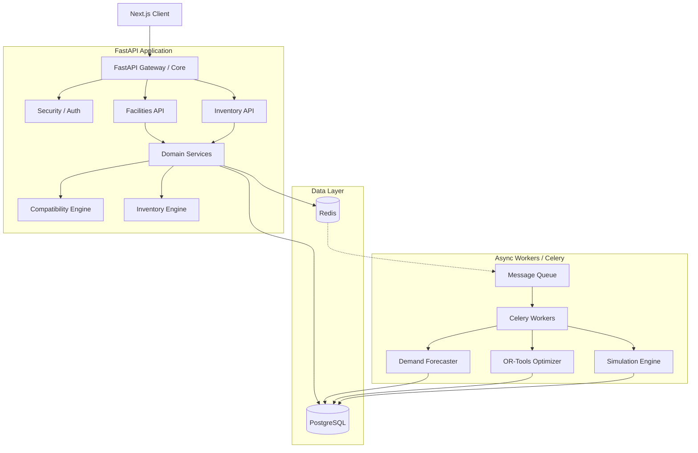

# BloodFlow Architecture

BloodFlow is designed as a modular, event-driven, microservices-ready monolith. It strictly enforces separation of concerns through Domain-Driven Design (DDD) principles.

## High Level System Architecture

## Core Domain Modules

1. **Blood Compatibility Engine** (`app/domain/blood_compatibility.py`)
   - Pure, deterministic logic governing the safe matching of donor blood components (RBC, Platelets, Plasma, Whole Blood) to recipients.
   - Evaluates emergency universal donor rules.

2. **Inventory Management Engine** (`app/domain/inventory.py`)
   - Reconciles total available supply, subtracting confirmed/expected demand, and calculating at-risk expiring units.
   - Outputs a standard facility Health Score.

3. **Optimization Engine** (`app/optimization/transfer.py`)
   - Uses Google OR-Tools to solve linear programming routing models.
   - Objective: Minimize distance/cost between facilities while resolving unit deficits from available surpluses.

4. **Forecasting Pipeline** (`app/ml/forecasting.py`)
   - Extensible pipeline that currently generates Moving Average and Exponential Smoothing forecasts from historical demand.

## Infrastructure

- **Database**: PostgreSQL handles all strict relational mappings and transactional state modifications (transfers, inventory updates).
- **Caching & Broker**: Redis is utilized for caching rapidly changing KPIs and acting as the message broker for Celery.
- **Workers**: Celery is utilized to run heavy computations (Optimization, Forecasting, Simulation) without blocking the FastAPI event loop.

## Security & Tenancy

BloodFlow is structured for Multi-Tenancy. All `Facility` and `User` records belong to an `Organization`. Application APIs assert organization context at the repository level to guarantee tenant isolation.
